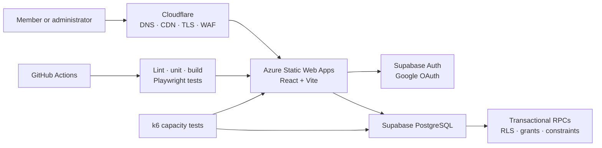

<div align="center">
  

  # AlbumASU

  **A production election and membership platform for Arizona State University's Album Listening Club.**

  [Live website](https://albumasu.com) · [Application documentation](voting-frontend/README.md) · [Infrastructure](voting-frontend/infra/README.md)
</div>

## At a glance

AlbumASU replaced the club's manual album-selection process with a secure,
three-stage election system used by more than 100 members across four production
elections.

Members nominate albums, vote in a primary, and rank five finalists. The
platform calculates the instant-runoff result, while approved administrators
manage membership, election phases, finalists, events, and site content.

| Production evidence | Result |
| --- | ---: |
| Club members supported | 100+ |
| Production elections | 4 |
| Verified concurrent virtual users | 100 |
| Load-test requests | 3,022 |
| p95 response time | 151.57 ms |
| Request failures | 0.00% |
| Automated browser checks | Desktop and mobile |

## What makes it technically interesting

- **Transactional voting:** PostgreSQL RPCs validate and submit ballots
  atomically, preventing duplicate votes, partial writes, unauthorized
  submissions, and race-condition-related inconsistencies.
- **Deterministic ranked-choice elections:** The instant-runoff engine handles
  multi-round elimination, ballot transfers, exhausted ballots, invalid
  rankings, and ties.
- **Database-enforced authorization:** Supabase Auth, PostgreSQL row-level
  security, restricted grants, and approved-member/admin roles protect election
  data independently of the React client.
- **Production cloud delivery:** Azure Static Web Apps hosts the application
  behind Cloudflare DNS, CDN, strict TLS, bot mitigation, custom WAF rules, and
  rate limiting.
- **Automated reliability:** GitHub Actions gates deployments on linting, unit
  tests, production builds, and production-build Playwright tests across desktop and mobile.
- **Measured capacity:** A read-only k6 workload exercises both Azure delivery
  and the production Supabase/PostgreSQL poll RPC at 100 concurrent virtual
  users.

## Architecture



## Election workflow

1. **Nominations:** each approved member may nominate one eligible album.
2. **Primary:** members select up to five nominees.
3. **Final:** members rank all five finalists.
4. **Instant runoff:** the system eliminates the lowest candidate round by
   round and transfers ballots until a majority winner or manual tie is found.

Each phase is enforced in PostgreSQL, not only in the interface. The database
checks membership status, active poll phase, candidate eligibility, ballot
shape, and one-submission-per-member constraints.

## Technology

| Layer | Technology |
| --- | --- |
| Frontend | React 19, Vite, responsive custom CSS |
| Authentication | Supabase Auth, Google OAuth |
| Backend | PostgreSQL, Supabase RPCs, row-level security |
| Cloud | Azure Static Web Apps, Azure Bicep |
| Edge security | Cloudflare CDN, strict TLS, WAF, bot protection, rate limiting |
| Delivery | GitHub Actions |
| Testing | Node test runner, Playwright, k6 |

## Repository guide

```text
.
├── .github/workflows/          CI/CD and performance monitoring
└── voting-frontend/
    ├── src/                    React application and voting logic
    ├── supabase/               Schema, transactional RPCs, and security hardening
    ├── infra/                  Azure Bicep infrastructure
    ├── tests/e2e/              Playwright browser tests
    ├── performance/            k6 capacity tests
    └── docs/                   Security, launch, QA, and benchmark documentation
```

## Run locally

```sh
cd voting-frontend
npm install
cp .env.example .env.local
npm run dev
```

Add a Supabase project URL and anonymous key to `.env.local` to exercise live
authentication and voting. Without them, the public site remains available with
bundled content for interface development.

Run the complete quality gate:

```sh
npm run check
```

For database setup and contributor details, continue to the
[application documentation](voting-frontend/README.md).

## Performance baseline

The verified July 2026 test ramped through 25, 50, and 100 virtual users, held
100 active sessions for two minutes, and exercised public Azure routes plus the
production `get_current_poll` PostgreSQL RPC.

- 3,022 requests and 1,511 completed user journeys
- 12.02 requests per second
- 151.57 ms p95 and 649.55 ms p99 response time
- 0.00% request failures and 100.00% successful checks

See the [benchmark methodology and scope](voting-frontend/docs/performance-benchmark.md).

## Security model

The browser never receives privileged database credentials. Authorization is
enforced through Supabase sessions, PostgreSQL RLS policies, function grants,
security-definer RPCs with fixed search paths, uniqueness constraints, and
server-side validation. Cloudflare and Azure provide the external delivery and
transport-security layers.

The detailed verification checklist is in
[`supabase-security-checklist.md`](voting-frontend/docs/supabase-security-checklist.md).
