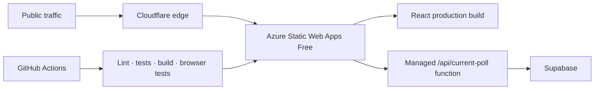

# AlbumASU cloud infrastructure

This directory contains the production infrastructure definition and the
reviewable Cloudflare security baseline for [AlbumASU](https://albumasu.com).

## Architecture



Cloudflare supplies strict TLS, HTTPS enforcement, DDoS and bot protection,
custom exploit-probe blocking, and a per-IP API limit for the public domain.
Azure Static Web Apps Free leaves its generated hostname reachable, so the API
also enforces its own per-IP limit and Supabase remains the authorization
boundary. Production links, monitors, and load tests must use the Cloudflare
domain rather than advertising or targeting the Azure hostname.

## Files

- `main.bicep` provisions Azure Static Web Apps Free and the hardened
  StorageV2 fallback resource.
- `cloudflare-security.json` records the Cloudflare settings and rules that must
  be applied to the `albumasu.com` zone.
- `cloudflare-security.schema.json` validates that baseline's structure.
- `../public/staticwebapp.config.json` contains routing, API runtime, and
  browser security headers.

The Cloudflare manifest is desired-state documentation. Cloudflare dashboard
changes must be checked against it during every production release.

## Application security boundary

The public poll read goes through `/api/current-poll`, which has an application
rate limiter and returns candidate/finalist arrays only to approved members.
Direct anonymous execution of `get_current_poll()` is revoked in Supabase.

Email signup, password login, and password reset include Cloudflare Turnstile
tokens that Supabase verifies. The Turnstile secret and Supabase service-role
key are server-side settings only and must never use a `VITE_` prefix.

Required Azure Static Web App application settings:

- `SUPABASE_URL`
- `SUPABASE_ANON_KEY`
- `SUPABASE_SERVICE_ROLE_KEY`

Required GitHub Actions build secret:

- `VITE_TURNSTILE_SITE_KEY` (the public Turnstile site key)

## Validate without creating resources

```sh
az deployment group validate \
  --resource-group alc-prod \
  --template-file infra/main.bicep
```

## Preview Azure changes

```sh
az deployment group what-if \
  --resource-group alc-prod \
  --template-file infra/main.bicep
```

## Deploy after reviewing the preview

```sh
az deployment group create \
  --name alc-storage \
  --resource-group alc-prod \
  --template-file infra/main.bicep
```

Validation and `what-if` do not provision resources. The `create` command can
change billable infrastructure and must only run after its preview is reviewed.
