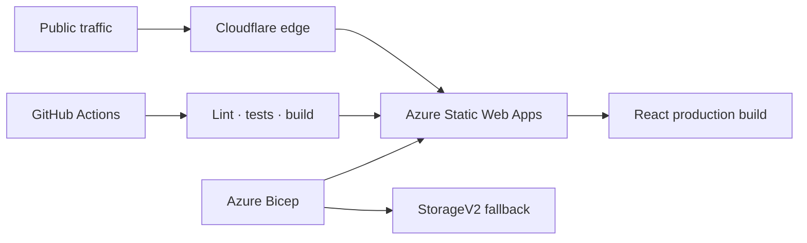

# AlbumASU cloud infrastructure

This directory contains the Azure Bicep definition for
[AlbumASU](https://albumasu.com), a production election platform serving
Arizona State University's Album Listening Club.

The infrastructure is intentionally small, reproducible, and cost-conscious:
Azure Static Web Apps provides managed global delivery while Cloudflare adds
the public domain, CDN, strict TLS, DDoS protection, bot mitigation, custom WAF
rules, and rate limiting.

## Architecture



## What the template provisions

### Azure Static Web Apps

- Free-tier managed static hosting
- Azure-generated production hostname
- Environment and ownership tags
- Output values used by deployment and DNS configuration

### Hardened StorageV2 resource

The template retains the original static-site resource as an infrastructure
exercise and fallback origin. It uses:

- locally redundant storage;
- HTTPS-only traffic and TLS 1.2 minimum;
- disabled anonymous blob access;
- disabled shared-key access;
- Microsoft Entra ID as the default authentication method;
- disabled cross-tenant replication;
- seven-day soft-delete retention.

## Delivery and security boundaries

Cloudflare terminates public edge traffic for `albumasu.com` and proxies it to
Azure. The production configuration uses strict TLS, HTTPS enforcement, bot
protection, a custom exploit-probe rule, and IP-based burst limiting.

Azure Static Web Apps Free does not support origin IP allowlisting. Its
Azure-generated hostname therefore remains publicly reachable alongside the
Cloudflare-protected custom domain. This limitation is documented rather than
presented as private-origin isolation.

Application authorization is separate from edge security. Supabase Auth,
PostgreSQL row-level security, function grants, and transactional RPCs protect
membership and election data.

## Deployment workflow

Every pull request runs the application quality gate. A push to `main` builds
the production bundle with GitHub-managed secrets and deploys it only after
linting, unit tests, build verification, and 22 Playwright tests pass.

## Validate without creating resources

```sh
az deployment group validate \
  --resource-group alc-prod \
  --template-file infra/main.bicep
```

## Preview changes

```sh
az deployment group what-if \
  --resource-group alc-prod \
  --template-file infra/main.bicep
```

## Deploy

```sh
az deployment group create \
  --name alc-storage \
  --resource-group alc-prod \
  --template-file infra/main.bicep
```

`validate` checks the template and parameters. `what-if` previews Azure resource
changes without applying them. `create` performs the reviewed deployment.

## Design decisions

- **Bicep over portal-only configuration:** infrastructure can be reviewed,
  reproduced, and discussed in source control.
- **Managed static hosting:** the React application does not require a
  continuously running web server.
- **Cloudflare Free at the edge:** the production site gains CDN and baseline
  security controls without the cost of Azure Application Gateway and Azure
  Web Application Firewall.
- **Separate data platform:** Supabase provides managed PostgreSQL and
  authentication while Azure owns frontend delivery.

Return to the [main project README](../../README.md).
